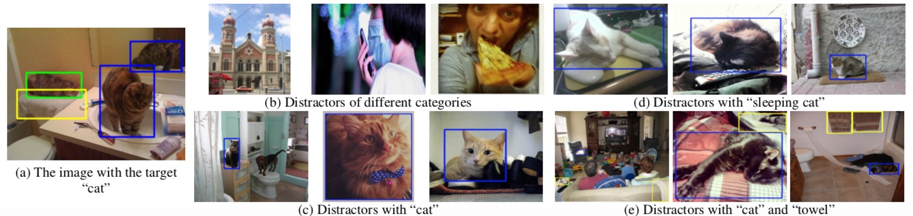

# Cops-Ref: A new Dataset and Task on Compositional Referring Expression Comprehension
This repo contains the Cops-Ref dataset and the main baseline.
Please refer to [our paper](http://www.visionlab.cs.hku.hk/publications/cops-Ref.pdf) for more information.
### An example

<figcaption>
<strong> Expression</strong>: "The cat on the left that is sleeping and resting on the white towel." 
  
<strong>Reasoning tree</strong>: cat (left, sleeping)  towel.
</figcaption>

### Contents
1. [Dataset](#Dataset)
2. [Installation](#Installation)
3. [Training](#Training)
4. [Testing](#Testing)

### Dataset
We provide the annotation of the dataset at [OneDrive](https://1drv.ms/u/s!AuraLuch5mF0gep2ppTH5XU2lq3_Aw?e=WDDSdZ). Please read [this](https://1drv.ms/t/s!AuraLuch5mF0gep0Xd1eeevq6PAx5w?e=ilr2bH) for details of the annotation.

### Citing Cops-Ref

If you find this repo useful in your research, please consider citing:

    @inroceedings{Chen_2020_CVPR,
    author = {Chen, Zhenfang and Wang, Peng and Ma, Lin and Wong, Kwan-Yee~K. and Wu, Qi},
    title = {Cops-Ref: A New Dataset and Task on Compositional Referring Expression Comprehension},
    booktitle = {Proceedings of the IEEE/CVF Conference on Computer Vision and Pattern Recognition (CVPR)},
    month = {June},
    year = {2020}
    }

### Contact

You can contact Zhenfang Chen by sending email to chenzhenfang2013@gmail.com
